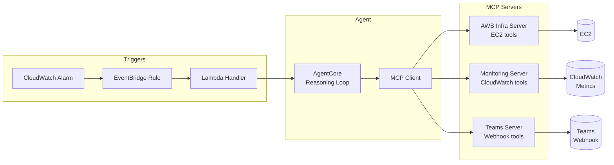

# DevOps AI Agent

An intelligent DevOps agent built on **AWS Bedrock AgentCore** that uses the **Model Context Protocol (MCP)** to manage AWS infrastructure, monitor resource health, and report incidents via Microsoft Teams.

## Architecture



## Quick Start

### Windows (one-time setup)

Run the setup script as **Administrator** (right-click PowerShell → "Run as Administrator"):

```powershell
powershell -ExecutionPolicy Bypass -File setup.ps1
```

This automatically:
- Installs **Chocolatey** (if missing)
- Installs **make** (if missing)
- Creates a `.venv` virtual environment
- Installs all project dependencies
- Configures git hooks (lint + commit message validation)

### After setup (all platforms)

```bash
# Activate virtual environment
.venv\Scripts\activate          # Windows PowerShell
source .venv/bin/activate       # Linux / macOS

# See all available commands
make help

# Commit changes (guided prompt with lint + format)
make commit

# Run tests
make test
```

### Manual setup (Linux / macOS)

```bash
# 1. Create & activate virtual environment
python -m venv .venv
source .venv/bin/activate

# 2. Install dependencies (dev + infra extras)
make install

# 3. Install git hooks
make hooks

# 4. Run linter & type checker
make lint
make typecheck

# 5. Run tests
make test

# 6. Start an MCP server locally (stdio transport)
make run-mcp-aws
```

## CDK Deployment

### Prerequisites

```bash
# Install the CDK CLI (one-time)
npm install -g aws-cdk

# Bootstrap CDK in your account/region (one-time)
cdk bootstrap aws://650251690796/ap-southeast-2
```

### Deploy All Stacks

```bash
# Activate venv first
.venv\Scripts\activate

# Deploy everything (Networking → Monitoring → Runner)
cdk deploy --all --require-approval never
```

### Deploy Individual Stacks

```bash
# Monitoring stack (CloudWatch alarm + EventBridge rule)
cdk deploy DevOpsAgent-Monitoring --require-approval never

# Agent Runner stack (Lambda function)
cdk deploy DevOpsAgent-Runner --require-approval never
```

### Other CDK Commands

```bash
# Synthesize CloudFormation templates (no deploy)
cdk synth

# Show diff between deployed and local
cdk diff

# Destroy all stacks
cdk destroy --all
```

### CDK Context (`cdk.json`)

The following context values configure the deployment:

| Key | Description | Example |
|-----|-------------|---------|
| `region` | AWS region | `ap-southeast-2` |
| `monitored_instance_id` | EC2 instance to monitor | `i-0bf11b006e8f12844` |

## Testing the Lambda

### Invoke with a Test Event

A sample CloudWatch alarm event is provided in `test_event.json`:

```bash
aws lambda invoke \
  --function-name devops-ai-agent-handler \
  --payload fileb://test_event.json \
  --cli-binary-format raw-in-base64-out \
  response.json \
  --region ap-southeast-2
```

### View the Response

```bash
# Linux / macOS
cat response.json | python -m json.tool

# Windows PowerShell
Get-Content response.json | python -m json.tool
```

### Expected Successful Response

```json
{
  "statusCode": 200,
  "body": {
    "alarm_name": "devops-agent-high-cpu",
    "instance_id": "i-0bf11b006e8f12844",
    "agent_response": "...",
    "tool_calls_count": 3,
    "session_id": "..."
  }
}
```

## Running Tests

```bash
# All tests
make test
# or: pytest -v

# Unit tests only
make test-unit
# or: pytest tests/unit/ -v

# Integration tests only
make test-integration
# or: pytest tests/integration/ -v
```

## Linting & Formatting

```bash
# Lint (check only)
make lint

# Auto-format + fix
make format

# Type check with mypy
make typecheck
```

## Running MCP Servers Locally

```bash
make run-mcp-aws          # AWS Infra server (EC2 tools)
make run-mcp-monitoring   # Monitoring server (CloudWatch tools)
make run-mcp-teams        # Teams server (webhook tools)
```

## Bedrock Model Verification

```bash
# List available models
aws bedrock list-foundation-models \
  --region ap-southeast-2 \
  --by-provider Anthropic \
  --query "modelSummaries[].modelId" \
  --output json

# Test direct model invocation
aws bedrock-runtime invoke-model \
  --model-id "amazon.nova-lite-v1:0" \
  --region ap-southeast-2 \
  --body '{"inputText":"hello"}' \
  --content-type application/json \
  response_model.json

# Test inline agent from Python
python -c "
import boto3
c = boto3.client('bedrock-agent-runtime', region_name='ap-southeast-2')
r = c.invoke_inline_agent(
    foundationModel='amazon.nova-lite-v1:0',
    instruction='You are a helpful DevOps assistant that diagnoses infrastructure issues.',
    sessionId='test-123',
    inputText='Say hello',
)
print([e for e in r['completion']])
"
```

## Cleanup

```bash
# Remove Python caches and build artifacts
make clean

# Destroy all deployed AWS resources
cdk destroy --all
```

## Directory Structure

```
devops-ai-agent/
├── infra/                        # IaC (CDK stacks)
│   ├── stacks/
│   │   ├── monitoring_stack.py   # CloudWatch alarms, EventBridge rules
│   │   ├── agent_runner_stack.py # Lambda for agent invocation
│   │   └── networking_stack.py   # VPC, subnets, security groups
│   └── app.py
├── src/
│   ├── agent/
│   │   ├── agent_core.py         # AgentCore client & reasoning bridge
│   │   ├── system_prompt.py      # Agent persona & instructions
│   │   └── config.py             # Env-based settings (Pydantic)
│   ├── mcp_servers/
│   │   ├── aws_infra/            # MCP server: EC2 tools
│   │   ├── monitoring/           # MCP server: CloudWatch metrics
│   │   └── teams/                # MCP server: Teams webhook
│   ├── mcp_client/
│   │   └── client.py             # Unified MCP client adapter
│   ├── handlers/
│   │   ├── lambda_handler.py     # EventBridge → Agent entry point
│   │   └── event_parser.py       # Alarm event → typed dataclass
│   └── utils/
│       ├── aws_helpers.py        # Shared boto3 helpers
│       └── teams_webhook.py      # Low-level webhook HTTP helper
├── tests/
├── demo.py                       # 🚀 Interactive demo — see below
├── pyproject.toml
├── Makefile
└── README.md
```

## Demo / Helper Script

Run the **`demo.py`** script for a guided walkthrough of every module:

```bash
python demo.py
```

It will:
1. Show how to load configuration
2. Demonstrate MCP tool discovery & invocation (mocked)
3. Simulate an EventBridge alarm event parse
4. Simulate a Teams notification
5. Show the full agent reasoning flow end-to-end

## Prerequisites

| Requirement | Notes |
|---|---|
| Python 3.12+ | Required |
| AWS CLI configured | For boto3 credentials |
| AWS Bedrock AgentCore access | Request Claude model access |
| Microsoft Teams webhook URL | Create an Incoming Webhook connector |
| CDK CLI (`npm i -g aws-cdk`) | For deploying infra stacks |

## Environment Variables

| Variable | Description | Default |
|---|---|---|
| `AWS_REGION` | AWS region | `us-east-1` |
| `BEDROCK_MODEL_ID` | Bedrock model identifier | `anthropic.claude-3-5-sonnet-20241022-v2:0` |
| `AGENT_ID` | Bedrock agent ID (omit for inline mode) | — |
| `AGENT_ALIAS_ID` | Bedrock agent alias (omit for inline mode) | — |
| `TEAMS_WEBHOOK_URL` | Teams Incoming Webhook URL | — |
| `TOOL_TIMEOUT_SECONDS` | Per-tool call timeout | `30` |
| `LAMBDA_TIMEOUT_SECONDS` | Lambda function timeout | `300` |
| `MAX_REASONING_TURNS` | Max agent reasoning iterations | `10` |
| `LOG_LEVEL` | Logging level | `INFO` |
| `LOG_FORMAT` | Log format (`json` or `text`) | `json` |

> **Inline vs Registered mode:** When `AGENT_ID` and `AGENT_ALIAS_ID` are both set, the agent uses `invoke_agent` (pre-registered). When omitted, it uses `invoke_inline_agent` (sends system prompt and tools inline each request).

## License

MIT
