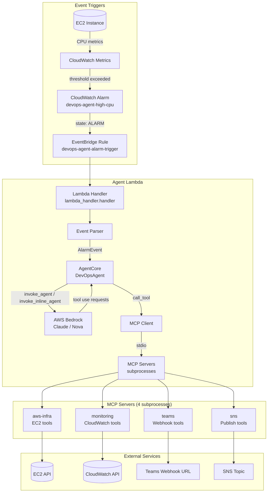
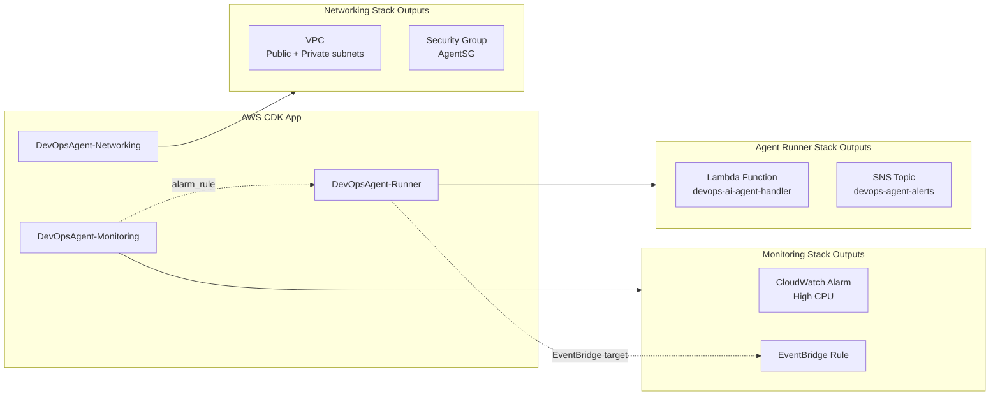
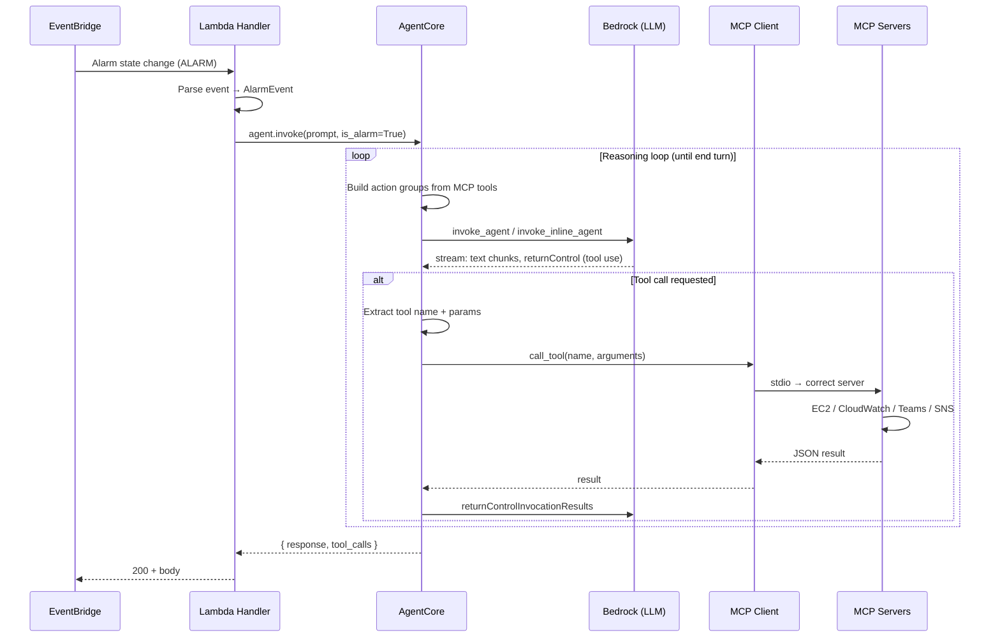
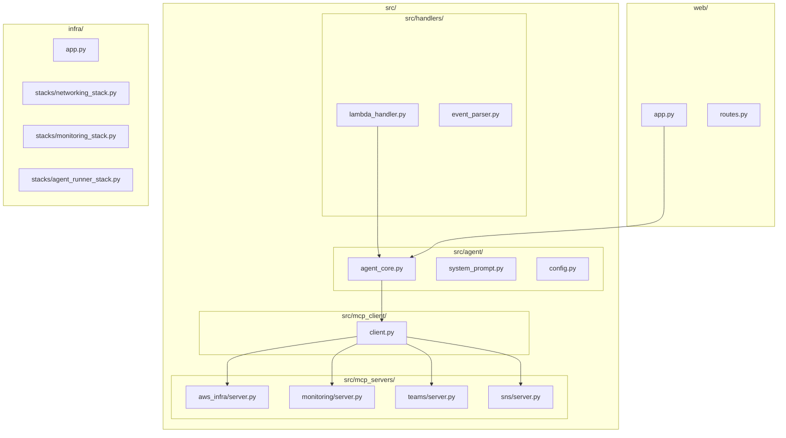
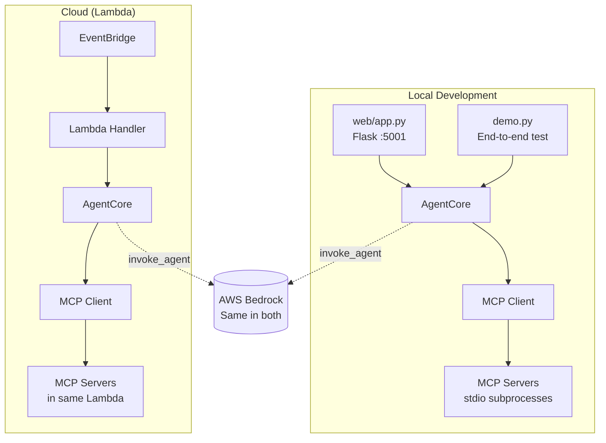
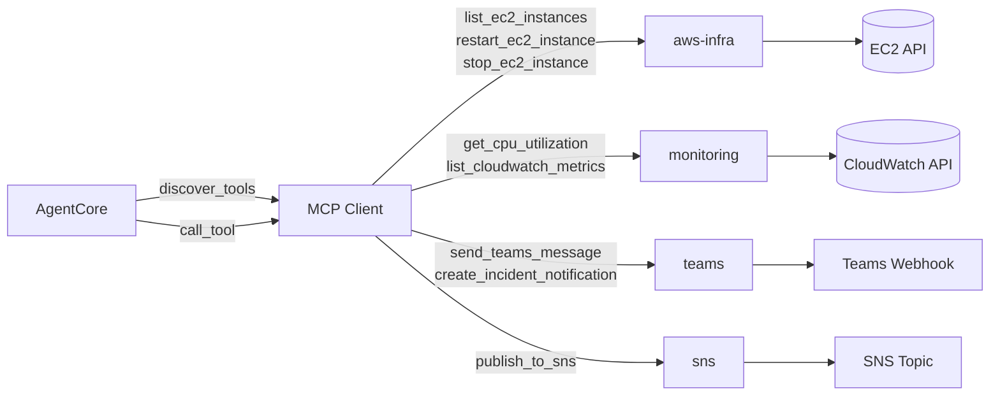

# DevOps AI Agent — Architecture Diagram

## System Overview

```
┌─────────────────────────────────────────────────────────────────────────────────────────┐
│                           DevOps AI Agent — Event-Driven Flow                            │
└─────────────────────────────────────────────────────────────────────────────────────────┘
```

---

## 1. Cloud Runtime Architecture (Production)



---

## 2. CDK Infrastructure Stacks



---

## 3. Agent Reasoning Loop (Detailed)



---

## 4. Source Code Layout



---

## 5. Local Development vs Cloud Deployment



---

## 6. MCP Tool Routing



---

## 7. Data Flow Summary

| Stage | Component | Input | Output |
|-------|-----------|-------|--------|
| 1 | CloudWatch | EC2 CPU metrics | Alarm state change |
| 2 | EventBridge | Alarm event | Lambda invocation |
| 3 | Lambda Handler | Raw event | Parsed AlarmEvent |
| 4 | AgentCore | Prompt + tools | Bedrock request |
| 5 | Bedrock | Prompt + tool results | LLM response / tool use |
| 6 | MCP Client | Tool name + args | MCP server call |
| 7 | MCP Servers | Tool call | AWS API / Teams / SNS |
| 8 | AgentCore | Tool results | Next Bedrock turn or final response |
| 9 | Lambda Handler | Agent response | HTTP 200 + JSON body |
